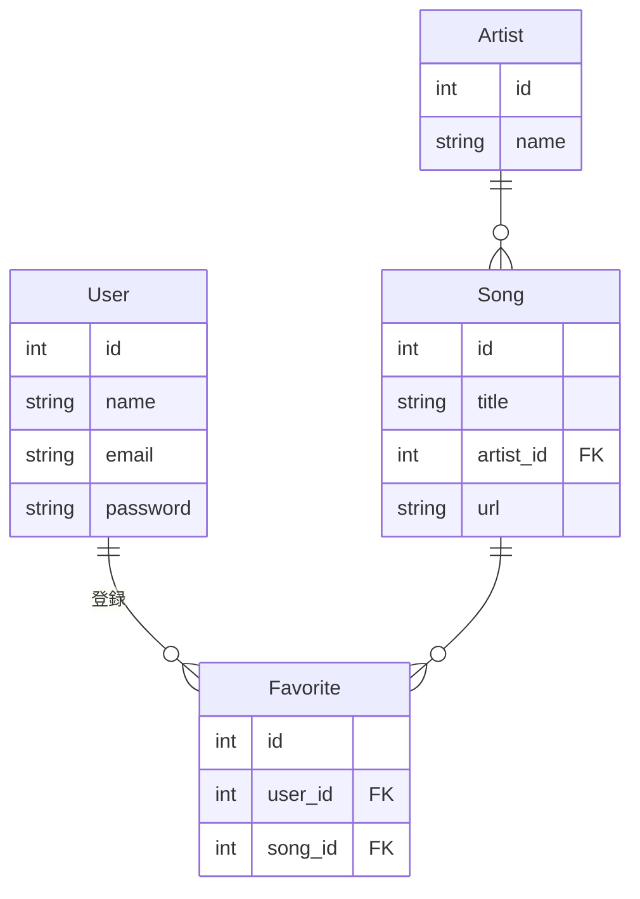

# 音楽配信サービス システム仕様書

## 1. 背景と目的
近年、多様な音楽ニーズに応えるためのオンライン音楽配信サービスの需要が増している。本システムは、ユーザーが楽曲を検索し、ストリーミング視聴できる環境を提供することを目的とする。また、ユーザーが好きな楽曲をお気に入りリストに保存できる機能も提供する。

管理者は、アーティストおよび楽曲の登録・編集・削除が可能な管理画面を持ち、楽曲情報を適切に管理できるようにする。

## 2. 機能要件
### 2.1 ユーザー機能
- ユーザーの新規登録・ログイン・退会
- 楽曲の検索（曲名・アーティスト名）
- 楽曲のストリーミング視聴
- お気に入り楽曲の登録・削除
- お気に入り楽曲一覧の表示

### 2.2 管理者機能
- 管理者ログイン（.envファイルに設定されたパスワードによる認証）
- アーティストのCRUD（作成・更新・削除）
- 楽曲のCRUD（作成・更新・削除）

## 3. 非機能要件
- **セキュリティ**：管理者ページはパスワード認証を必須とし、環境変数により管理
- **パフォーマンス**：SQLiteを採用し、少量データでの高速検索を実現
- **保守性**：Next.jsのApp Routerを採用し、フロントエンドとバックエンドの統合管理
- **拡張性**：将来的な機能追加に対応できる構成を考慮

## 4. 制約事項
- 開発言語：TypeScript
- フロントエンド：Next.js
- バックエンド：Next.js API Routes
- データベース：SQLite
- 認証方式：管理者のみパスワード認証（環境変数設定）
- デプロイ環境：Vercel or Railway (SQLiteを考慮)

## 5. ユースケース
### 5.1 ユーザー
1. ユーザーがシステムにアクセスする
2. アカウントを新規登録し、ログインする
3. 楽曲を検索する
4. 検索結果から楽曲を選択し、ストリーミング再生する
5. お気に入り楽曲を登録する
6. お気に入り一覧から楽曲を視聴する
7. アカウントを削除（退会）する

### 5.2 管理者
1. 管理者がログインする
2. アーティスト情報を追加・編集・削除する
3. 楽曲情報を追加・編集・削除する

## 6. 必要ページ一覧
| ページ | 目的 | 機能 |
|--------|------|------|
| ホーム | ユーザーが楽曲を検索し、視聴する | 楽曲検索、再生機能 |
| お気に入り | お気に入り登録した楽曲一覧を表示 | お気に入り楽曲の管理 |
| ユーザー登録・ログイン | ユーザーの新規登録・ログイン | ユーザー登録、認証処理 |
| アカウント設定 | 退会処理を行う | 退会機能 |
| 管理者ログイン | 管理者の認証 | パスワード入力、認証処理 |
| 管理画面（アーティスト） | アーティスト情報の管理 | アーティストCRUD |
| 管理画面（楽曲） | 楽曲情報の管理 | 楽曲CRUD |

## 7. ER図

## 8. その他
- **ダミーデータの準備**
  - 初期データとして、サンプルのアーティスト・楽曲データを用意
  - SQLiteのシードデータを用意し、簡単に初期データを投入可能とする
- **APIエンドポイント一覧**
  - `/api/auth/register`（POST: ユーザー登録）
  - `/api/auth/login`（POST: ログイン処理）
  - `/api/auth/delete`（DELETE: 退会処理）
  - `/api/songs`（GET: 楽曲一覧取得）
  - `/api/songs/:id`（GET: 楽曲詳細取得）
  - `/api/favorites`（POST: お気に入り登録, DELETE: お気に入り削除）
  - `/api/admin/artists`（CRUD: アーティスト管理）
  - `/api/admin/songs`（CRUD: 楽曲管理）

